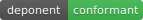

# Deponent

[](#proven) &nbsp;·&nbsp; **Apache-2.0** &nbsp;·&nbsp; verify the mark yourself: `python3 -m deponent.badge verify --kernel deponent`

**A governed sovereign agent kernel. It doesn't answer. It testifies.**

A local AI agent runs on your machine. It edits files, runs commands, touches your system — and when it finishes, all you have is its word that it behaved, and a failed step reports success as readily as a real one. Deponent replaces the word with a record you can verify yourself.

It is a small, model-agnostic governance layer that sits under any agent's tool calls:

```
deny-by-default gate  ->  Seatbelt jail  ->  tamper-evident ledger  ->  verifiable receipt
```

~3,300 lines of pure Python across 17 modules (+ a small `adapters/` subpackage), standard-library only — **zero third-party dependencies in the core.** Install: `pip install deponent`.

---

## Quickstart

```python
import tempfile
from deponent import Cell

cell = Cell(tempfile.mkdtemp(), use_jail=False)   # a sovereign, local sandbox
                                                  # use_jail=True on macOS adds the Seatbelt jail
print(cell.act("write_file", {"path": "notes.txt", "content": "hello"}).output)  # ALLOW
print(cell.act("read_file",  {"path": "notes.txt"}).output)                      # ALLOW
print(cell.act("run_cmd",    {"cmd": "rm -rf /"}).output)                        # BLOCK (destructive)
print(cell.act("exfiltrate", {"to": "evil.example"}).output)                     # BLOCK (deny-by-default)

ok, msg = cell.verify()                           # recompute the chain — don't trust it
print(f"testimony intact: {ok} — {msg}")
```

That is exactly `examples/minimal.py`. Run it (`python3 examples/minimal.py`) and it prints:

```text
wrote 5 bytes -> notes.txt
hello
BLOCKED [destructive-or-out-of-scope]: matched deny pattern 'rm -rf'
BLOCKED [unknown-tool]: no policy for tool 'exfiltrate' (deny-by-default)

testimony intact: True — chain intact (4 entries)
  ALLOW write_file  [reversible-local-write]
  ALLOW read_file   [reversible-local-read]
  BLOCK run_cmd     [destructive-or-out-of-scope]
  BLOCK exfiltrate  [unknown-tool]
```

No model needed for the demo. No network. No install required to run it from the repo.

---

## Why this exists

Local agents are useful precisely because they act on your machine. That is also the risk: you are trusting they only did what they said they did.

A self-report is not evidence. Every system has two surfaces — what it says about itself and what it actually did — and they drift. Agents are no exception: "tests pass," "done," "cleaned up" is a claim, not a fact.

Deponent replaces the trust with a record. Every action an agent proposes is gated before it runs, jailed while it runs, and recorded after it runs into a hash-chained ledger you can re-verify from scratch. At the end you can **prove what happened** — or prove the record was altered. There is no third option.

---

## How it works

One object, `Cell`, is the whole architecture. Each action goes through `.act()`:

```
agent proposes an action
        │
        ▼
   ┌─────────┐   deny-by-default. unknown tool / path escape /
   │  GATE   │   destructive cmd / network / privilege  ->  BLOCK
   └────┬────┘
        │ ALLOW
        ▼
   ┌─────────┐   macOS Seatbelt: no network, writes confined to
   │  JAIL   │   the sandbox, CPU + memory + wall-clock bounded
   └────┬────┘
        │ output
        ▼
   ┌─────────┐   append-only sha256 hash chain. every decision +
   │ LEDGER  │   a hash of its outcome, link-locked to the prior
   └────┬────┘
        │
        ▼
   ┌─────────┐   recompute the chain AND the content hash.
   │ RECEIPT │   verify() is real — there is no return-True stub
   └─────────┘
```

- **The Gate** governs the shell + path surface — which programs may run, which paths may be touched, whether a command chains or substitutes its way out of policy. Deny-by-default and fail-closed: anything it cannot classify is blocked. It can also gate on real blast radius: wire a `ReachOracle` (opt-in) and a write is gated on its **reverse-dependency closure** — what the action can reach, not just what string it contains. The default policy is the substring + path gate; the reach closure is opt-in.
- **The Jail** closes the gap the gate cannot see: the *code inside* an allowed command. On macOS the native primitive is `sandbox-exec` (Seatbelt) — no Docker assumed.
- **The Ledger** is the testimony: an append-only, hash-chained record where mutating or reordering any past entry breaks the re-link.
- **The Receipt** is the closure artifact. Its verifier recomputes the chain from genesis *and* recomputes the receipt's own content hash. `persist()` runs that verifier as a write-time round-trip and **raises on failure**, so a corrupt write can never be reported as success.

The Cell is the keystone, and it composes at every scale: one tool call, one agent, or a whole team sharing one ledger. The kernel does not change when the model does. Subclass `Cell` and override `_execute` to govern your own tool surface — the gate + jail + ledger wrapping is inherited unchanged.

---

## What it does NOT do

This section is the trust anchor. Read it before you build on this.

- **It is a reference governance primitive, not a hardened production sandbox.** It is the smallest honest version of the idea — clear enough to read end-to-end, strong enough to be useful, not a certified security product.
- **The in-language jail is macOS-only.** Seatbelt is the native primitive. On Linux you plug in firejail, nsjail, or a container. The gate and ledger are platform-independent; only the jail is swapped.
- **It is tamper-EVIDENT, not tamper-PROOF.** The ledger core is a **keyless sha256 hash chain** — nothing in the agent's execution path is signed. It proves *internal consistency* — that no entry was altered or reordered — **not authorship.** An attacker who can rewrite the entire file from genesis can produce a consistent chain. The core ledger is **not cryptographic signatures.** There is an **optional, verification-only ed25519 operator-attestation overlay** (`operator_attest.py`, opt-in via `deponent[attest]`) that verifies an operator's out-of-band signature over a run; it signs nothing the agent does. The core stays keyless on purpose — asymmetric signing in the execution path is a deliberate non-goal.
- **The default gate policy is a sane coding-agent sandbox, not a universal security policy.** It is overridable per instance (`deny=`, `allow_heads=`). Tune it for your tool surface.

State the limits, or the guarantees mean nothing.

---

## Proven

**146 tests total** across 15 files. On this macOS host (Docker + optional extras present) `make test` gives **144 pass / 2 skip** — the 2 skips are optional-dependency paths (compliance-export backend; sworncode adapter), never failures. A plain macOS host without Docker skips the 6 Docker-backend tests too, and off-macOS the live Seatbelt jail tests skip — so the pass/skip split is honestly host-dependent. Run `make test` to see your host's number. Breakdown (collected):

| module | tests | what it proves |
|---|---:|---|
| `gate.py` | 13 | deny-by-default; path-escape BLOCK; destructive/network/privilege BLOCK; chaining + command-substitution BLOCK; allowlist ALLOW |
| `jail.py` | 14 | network denied, writes confined, resource caps enforced — **against the real macOS sandbox, live** |
| `jail_backends.py` | 10 | backend dispatch + confinement contract (Seatbelt live; Docker when a daemon is present) |
| `claims.py` | 15 | claim-mode: the run testifies what it can/cannot attest — ATTESTED inside coverage, ABSTAIN outside |
| `reach.py` | 10 | graph-derived blast radius: reverse-dependency closure, not a substring guess |
| `reconcile.py` | 8 | two-plane observed-vs-declared: an undeclared change is caught, not the agent's word |
| `receipts.py` | 7 | recompute-not-trust verifier; corrupt write raises; tampered chain or metadata → `False` |
| `conformance.py` | 10 | GAK conformance harness: scores any kernel pass/fail against the standard — across two profiles, action-gate **and** commit-gate |
| `badge.py` | 12 | the earnable `GAK-conformant` mark: certify/verify, reproducible `clauses_digest`, red when not conformant (a badge that can't be faked) |
| `playground.py` | 21 | the public playground: score any agent trace against the real kernel, per-clause pass/fail |
| `profiles.py` | 6 | build-profile policy: reversible/local ALLOW, irreversible BLOCK (blast-radius-scoped) |
| `operator_attest.py` | 6 | optional verification-only ed25519 overlay; emits a cell only on a passing verification |
| `cell.py` | 6 | gate → jail → ledger wiring; one `.act()` = one testified action |
| `selfgate.py` | 4 | the kernel governs its OWN build (`make self-gate-live`) and stays conformant + sound |
| `ledger.py` | 4 | hash chain links; mutation/reorder breaks `verify()` with a location |

The jail tests invoke the **real macOS sandbox (`sandbox-exec`) live — not mocked** — and skip automatically off-macOS. **It eats its own dog food:** `make self-gate-live` runs a real jailed git+rustc build through the gate, jail, and ledger (local commit ALLOWs, push BLOCKs at the irreversible boundary) and emits receipts for the run. And it's testable as a standard: `python3 -m deponent.conformance` scores the reference kernel pass/fail against the GAK clause set — across two governance shapes, action-gate kernels and commit-gate kernels (the latter via `sworn_adapter.py`, an optional adapter for the commit-time sibling sworncode; the core never imports it). Point it at your own kernel too.

**The `GAK-conformant` mark.** Passing the harness is earnable infrastructure, not a self-claim. `python3 -m deponent.badge certify --kernel deponent` emits a self-contained badge (the SVG above), a markdown snippet, and a JSON receipt carrying a sha256 `clauses_digest` over the per-clause results — so the badge maps to a specific, reproducible outcome. Re-derive it yourself, fail-closed:

```sh
python3 -m deponent.badge verify --kernel deponent   # exit 0 only when the mark is earned
```

Any kernel that implements the small adapter and passes the clause set earns the same mark; a kernel that fails gets a red "not conformant" badge and a non-zero exit. The badge is generated locally — no shields.io, no network — because a sovereignty product shouldn't phone home to prove it passed.

**Seatbelt escape-proofs — two kinds, kept separate so the claim is exactly as strong as the evidence.** (1) **Committed live canaries** (`canaries/CANARIES.md`, J1–J8): network exfil, raw-socket egress, writes outside the sandbox, child-process escape, memory-bomb, and wall-clock runaway — each a real test run against the live macOS sandbox, 0 through; if a canary stops holding, the suite goes red. (2) **Manual development red-team** — during development I hand-ran Seatbelt bypasses (`osascript 'do shell script'`, `launchctl submit`, loopback `/dev/tcp`, DNS, symlink/hardlink/rename writes-out), all blocked; these **shaped the gate denylist and the Seatbelt profile but are not committed tests** — take them as reported, not reproducible from the repo.

**Recompute-not-trust receipts:** the verifier does not read a stored boolean. It re-links the chain from genesis and recomputes the receipt's content hash over its canonical body. `persist()` runs that verifier on write and raises on failure. This is the project's core rule made mechanical: *self-reported health is never the evidence.*

---

## The governed agent team (example)

`examples/governed_team.py` builds a real team on the kernel: **Architect → gated Builder → advisory Reviewer**, sharing one local model, model-agnostic via `examples/backends.py` (MLX or Ollama — add your own). Closure is never the Builder saying "done": it is an out-of-band pytest re-run, an intact hash chain, and a rogue action proven blocked live.

The reference local model is **North Mini Code 1.0** (Cohere, 30B MoE / 3B active, Apache-2.0), which runs on Apple Silicon via `mlx-vlm`.

> **Honest bench caveat — directional, not statistically significant (n ≈ 17).** North Mini scored 0.749 vs `qwen3-coder:30b` 0.686, winning 6 of 9 tasks. That is a signal, not a result. Do not cite it as a benchmark win.

The point of the example is not the model — it is what governance does *to* a model. In my development sweeps (the sweep harness isn't in this repo yet — take these as reported, not reproducible-here), governance made a flaky local model **fail loud, never silently wrong**: no module, or it won't compile — never a buggy module quietly accepted. Decoupling the stochastic advisory Reviewer from the hard gate also lifted how often the pipeline certified cleanly, but the sample is small and the harness isn't here, so I'm leaving the precise numbers out rather than overstate them. What you *can* run today is in `tests/` and the demo: the team blocks a live rogue action and refuses to certify a broken chain. Governance turns a flaky local model into a worker that **fails visibly** — that is the claim, not a leaderboard.

```bash
# Ollama (any tool-capable coder)
python3 examples/governed_team.py --backend ollama --model qwen3-coder:30b \
  --goal "Implement reverse_words(s): reverse word order, collapse runs of spaces."

# Local MLX North Mini Code (Apple Silicon)
DEPONENT_MLX_MODEL=mlx-community/North-Mini-Code-1.0-4bit \
  python3 examples/governed_team.py --backend mlx --goal "..."
```

---

## Install + run the tests

```bash
git clone <repo> deponent && cd deponent
python3 -m pip install -e .        # or just run from the repo — the core needs no install

make test                          # 146 tests (144 pass / 2 skip on this host; Docker/jail/attest/sworncode paths auto-skip, count is host-dependent)
make demo                          # the minimal testify demo, no model needed
```

The kernel has **zero third-party dependencies.** Only the example team needs a model runtime; the kernel does not.

---

## Where this sits

Deponent is the **open-core primitive** beneath a small portfolio built on one thesis — *it doesn't answer, it testifies* — and one build principle: *auditable emergence from sovereign local primitives, at every scale.*

- **Archivist** — local-first forensic document intelligence
- **SafetySpine** — deterministic drone safety kernel
- **Governor Console** — deny-by-default deployment gating
- **Fleet Watch** — process-governance daemon with a hash-chained audit log

Deponent is the smallest version of the same idea, given away. The kernel is open and complete on its own; the commercial safety-kernel siblings I'm building toward (SafetySpine, Governor Console) stay commercial — open-core, not a teaser.

Built by CJ, founder of Centennial Defense Systems (Colorado Springs) — former U.S. Marine, solo. This is its public launch.

---

## Support

Solo project — **security reports get answered** ([SECURITY.md](SECURITY.md)); everything else is best-effort, no SLA, no roadmap. PRs are welcome, but the kernel stays small and deny-by-default by design, so "welcome" isn't "merged."

---

## License

Apache-2.0 — including the patent grant.

**Permissive forever.** Deponent is open-core under Apache-2.0, and the public kernel
will stay that way. This is not a teaser license or a bait-and-switch: the kernel in
this repository will not be relicensed to a restrictive license, moved behind a paid
tier, or rug-pulled. The Apache-2.0 grant on every published version is irrevocable by
its own terms, and that is deliberate — a sovereignty product you cannot keep is not
sovereign. Commercial siblings (SafetySpine, Governor Console) stay commercial; that
is the open-core line, and it does not move the kernel out from under you.